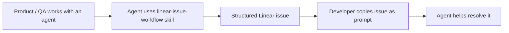

# oh-my-skills

A personal collection of skills that I have found useful.

Skills follow the [Agent Skills format](https://agentskills.io/home).

## Installation

Install all skills from this repository:

```bash
npx skills add 961853266hyt/oh-my-skills --all
```

List available skills before installing:

```bash
npx skills add 961853266hyt/oh-my-skills --list
```

Install a single skill:

```bash
npx skills add 961853266hyt/oh-my-skills <skill-name>
```

## Skills

### `linear-issue-workflow`

Automate Linear issue workflows for small teams by helping product, QA, and engineering collaborate through agent-ready issues.

**When to use**

- Product or QA needs an agent to turn a bug report or request into a structured Linear issue.
- Engineering wants Linear issues that are ready to copy as prompts for coding agents.
- Small teams want a lightweight workflow that reduces repeated clarification between product, QA, and engineering.



## License

MIT
