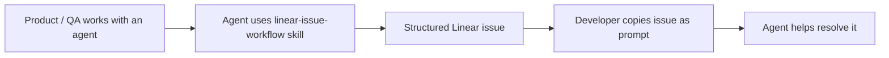

# oh-my-skills

A personal collection of skills that I have found useful.

## Skills

### `linear-issue-workflow`

Automate Linear issue workflows for small teams by helping product, QA, and engineering collaborate through agent-ready issues.

